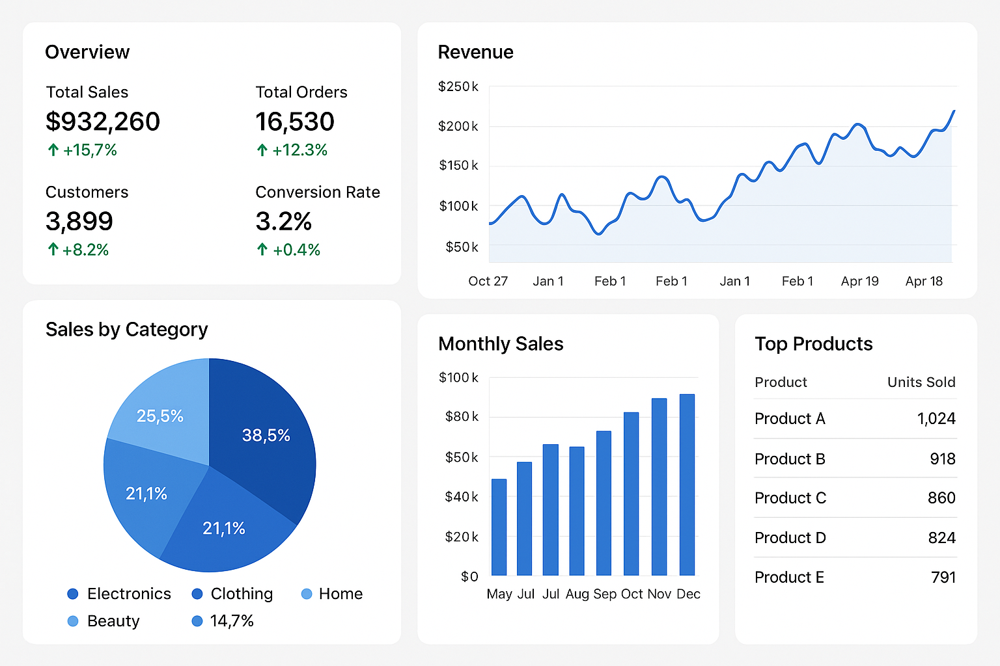

# E-Commerce Website

An interactive and user-friendly E-Commerce platform developed during my Full Stack Developer internship. This project features user and admin login functionality to ensure secure access and effective management.

## 🚀 Features
- **User Authentication:** Secure login system for both users and admins.
- **Product Management:** Admin panel for adding, editing, and deleting products.
- **User Dashboard:** Browse products, add to cart, and checkout functionality.
- **Order Management:** Admin can view and manage user orders.
- **Responsive Design:** Ensures optimal user experience across devices.

## 🛠️ Tech Stack
- **Frontend:** HTML, CSS, JavaScript
- **Backend:** PHP
- **Database:** MySQL

## 📂 Repository Structure
```
├── assets
│   ├── html
│   ├── css
│   ├── js
│   └── images
├── admin
│   ├── login.html
│   ├── login.php
│   ├── upload_products.html
│   ├── upload_products.php
│   ├── view_products.php
│   ├── delete_products.php
│   └── data.php
├── client
│   ├── login.html
│   ├── login.php
│   ├── logout.php
│   ├── registration.html
│   ├── registration.php
│   ├── validate_login.php
│   ├── view_products.php
│   ├── viewcart.php
│   ├── addtocart.php
│   └── placeorder.php
└── README.md
```

## ⚙️ Installation & Setup
1. **Clone the Repository:**
   ```bash
   git clone https://github.com/17devraj/ecommerce-website.git
   ```

2. **Setup Database:**
   - Create a MySQL database.
   - Import the provided `database.sql` file.

3. **Configure Database Connection:**
   - Edit the `data.php` file with your database credentials.

4. **Start the Server:**
   ```bash
   php -S localhost:8000
   ```

5. **Access the Project:**
   - **User Login:** `/client/login.php`
   - **Admin Login:** `/admin/login.php`

## 📸 Screenshots
| **User Dashboard** | **Admin Panel** |
|:-------------------:|:----------------:|
|  |  |

## 🔮 Future Improvements
- Implement product search functionality.
- Add payment gateway integration.
- Introduce user profile customization.

## 👨‍💻 Author
**Devraj Parmar**  | [LinkedIn](https://www.linkedin.com/in/devraj-parmar/)

